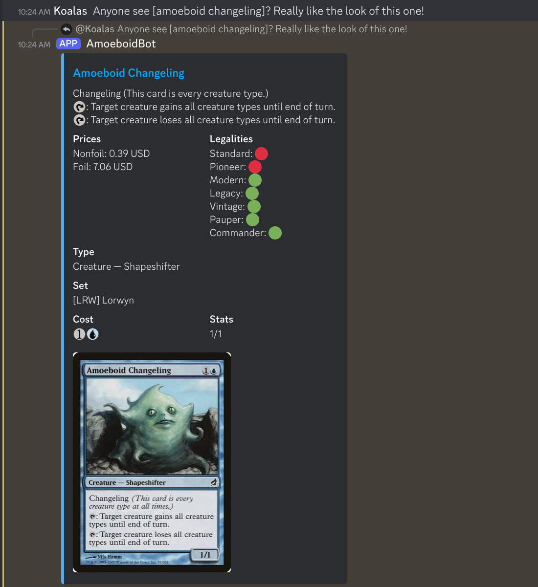

# AmoeboidBotRedux

## Description

A Discord bot for requesting data about Magic the Gathering cards.

Data can be queried through commands to fetch individual cards, or can be wrapped in text to query multiple cards, or to use in conversation.

---

## Commands

- `/card` (`name`, `set?`): Search for a single card by name. The name is autocompleted, and the set can optionally be specified.
- `/art` (`name`, `set?`): Search for a single card by name, but return a full art crop image instead of the normal embed with all the card data.
- `/rulings` (`name`): Look up rulings for a given card by name.

### Admin Specific Commands

- `/wrapping` (`wrapping?`): View or set the card detection wrapping. Returns the current server wrapping (if it exists) if no wrapping specified, and sets the wrapping if one is specified. To specify a wrapping, put a `*` character inside your preferred wrap characters (for example, `[[*]]`).

---

## Setup

### Running Locally

To run the bot locally, you'll need to first install Nodejs (v20 is recommended). As well, you'll need `yarn`, which you can install with `npm i -g yarn`.

To run the project, first run `yarn prisma migrate`. This will initialize the database file for caching card data and storing server specific configs.

Then, copy the `.env.dist` to a new `.env` file and populate the `DISCORD_TOKEN` and `GUILD_ID` keys.

After that, you should be able to run `yarn start` to launch the program.
